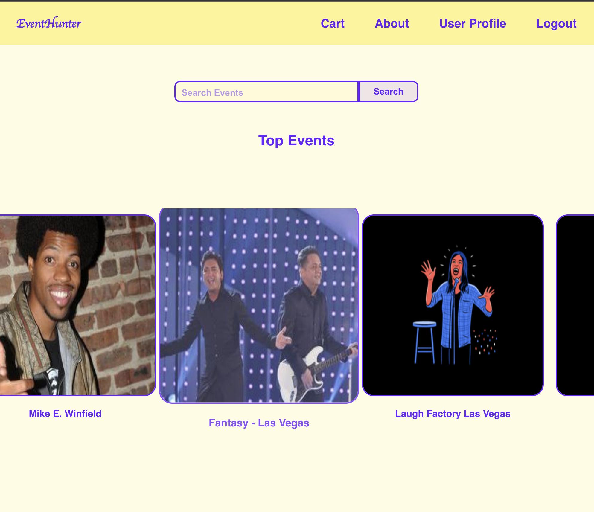

# Event-Hunter-PERN

## **_Table of Contents:_**

1. More About Me
2. Motivation
3. Project Description
4. Technologies Used
5. Future Updates
6. Credits

[Trello Board](https://trello.com/b/4TDr5Px9/event-hunter)

[Entity Relationship Diagram](https://drive.google.com/file/d/1mJaOjlVm1Tikqp37YE9Tc4qG_zQpGcu1/view?usp=sharing)

[Component Hierarchy Diagram](https://lucid.app/lucidchart/3b28251c-faba-4220-a3e0-612451f15d9b/edit?viewport_loc=-11%2C-72%2C1879%2C1279%2C0_0&invitationId=inv_97f7800a-062a-4e0a-b619-2eb0b64ee92d)

---

## **_More About Me_**

|         Name          |                                                             GitHub                                                              |                                                                        LinkedIn                                                                         |
| :-------------------: | :-----------------------------------------------------------------------------------------------------------------------------: | :-----------------------------------------------------------------------------------------------------------------------------------------------------: |
| Hatice Tuba Yorukoglu |  |  |

---

### **_Motivation_**

My motivation for this capstone project was to show my best programming skills as building an event tracker website. While using my existing knowledge of React, Express, JavaScript, PostgreSQL; I integrate other useful technologies like API, user authentication methods.
I accomplished this after only 11 weeks of instruction enrolled in General Assembly's Software Engineering Immersive program.

---

### **_Description:_**

Event Hunter is a PERN stack application provides event tracking. Users can sign up/login, search events, show event details and give orders to join the most popular events on this platform. Events pops up using an external API (SeatGeek). It has full CRUD operations for user.

---

### **_Technologies Used_**

- [TRELLO Board](https://trello.com/b/DQ0A8xV5/patientpathway)
- HTML
- CSS
- JavaScript
- React.js
- Express.js
- Node.js
- PostgreSQL
- External API

---

### **_Future Updates_**

1. Getting events by categories
2. Adding event options for users
3. Getting events by user's location
4. Improved payment page

---

### **_Credits:_**

- Trello
- MDN Web Docs
- W3 Schools
- Geeks for Geeks
- Google Fonts
- LucidApp
- draw.io
- [SEAT GEEK](https://platform.seatgeek.com/#events)
