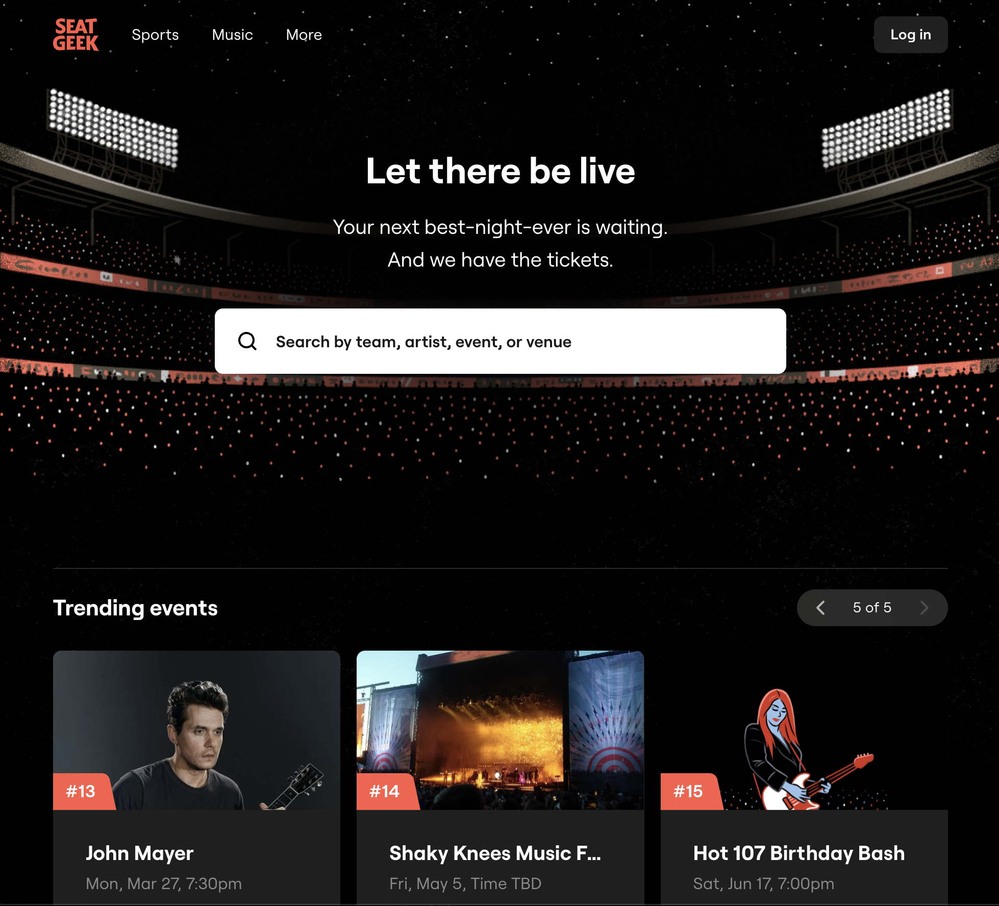

# Event-Hunter-PERN

## **_Table of Contents:_**

1. More About Me
2. Motivation
3. Project Description
4. Technologies Used
5. Future Updates
6. Credits

[Trello Board](https://trello.com/b/4TDr5Px9/event-hunter)

[Entity Relationship Diagram](https://drive.google.com/drive/u/0/my-drive)

[Component Hierarchy Diagram](https://lucid.app/lucidchart/3b28251c-faba-4220-a3e0-612451f15d9b/edit?beaconFlowId=770542B939E5BEE3&invitationId=inv_97f7800a-062a-4e0a-b619-2eb0b64ee92d&page=0_0#)

---

## **_More About Me_**

|         Name          |                                                             GitHub                                                              |                                                                        LinkedIn                                                                         |
| :-------------------: | :-----------------------------------------------------------------------------------------------------------------------------: | :-----------------------------------------------------------------------------------------------------------------------------------------------------: |
| Hatice Tuba Yorukoglu |  |  |

---

### **_Motivation_**

My motivation for this capstone project was to show my best programming skills as building an event tracker website. While using my existing knowledge of React, Express, JavaScript, PostgreSQL; I integrate other useful technologies like API, UI libraries, user authentication methods.
I accomplished this after only 11 weeks of instruction enrolled in General Assembly's Software Engineering Immersive program.

---

### **_Description:_**

Event Hunter is a PERN stack application provides event tracking. Users can sign up/login, search events by filtering, show event details and buy tickets on this platform. Events pops up in different categories using an external API.

---

### **_Technologies Used_**

- [TRELLO Board](https://trello.com/b/DQ0A8xV5/patientpathway)
- HTML
- CSS
- JavaScript
- React.js
- Express.js
- Node.js
- PostgreSQL
- External API
- UI library

---

### **_Future Updates_**

1. Past events category
2. Data visualization options
3. Event Review option
4. Make an 'event reminder list'

---

### **_Credits:_**

- Trello
- MDN Web Docs
- W3 Schools
- Geeks for Geeks
- Google Fonts
- LucidApp
- draw.io
- seatgeek.com
